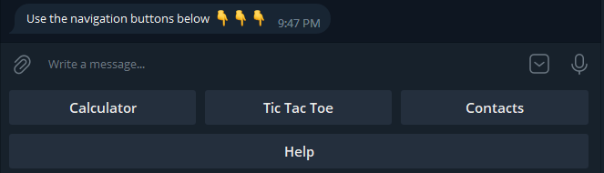
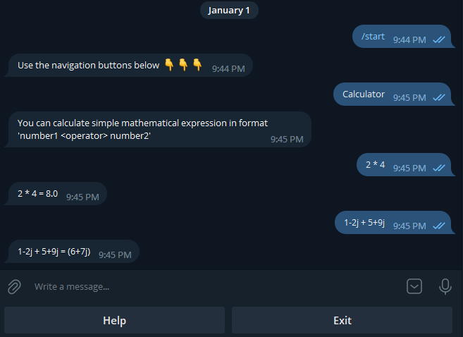
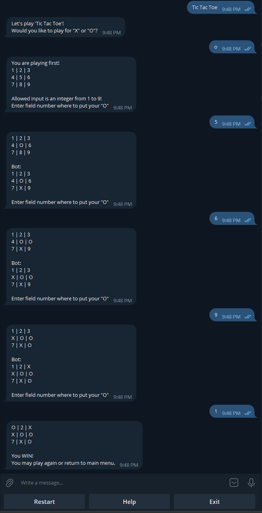
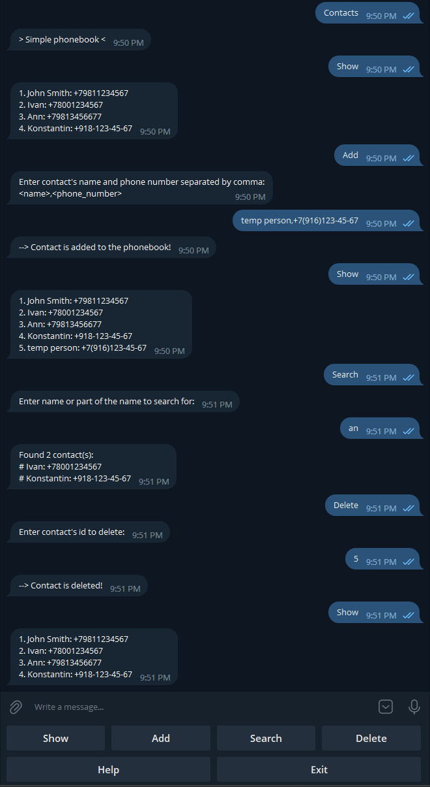

# Telegram Bot 'NumeroUno'

После запуска сервера, бот будет доступен по ссылке https://t.me/HW9_TicTacToe_bot

В данном боте реализован следующий функционал:
* Калькулятор
* Игра 'Крестики-Нолики'
* Телефонная книга

С любого экрана доступна кнопка "Помощь", которая содержит информацию с кратким описанием, доступными командами и 
форматом ввода, если применим.

---
### Калькулятор

Здесь можно выполнить простые арифметические операции: сложение, вычетание, умножение и деление, над двумя числами 
(в том числе и комплексными). Поддерживаемый формат для ввода выражения для вычисления: **<число1> <оператор> <число1>**.
Части выражения должны быть обязательно отделены пробелом.

Например:

    >> 34 + 678
    >> 5j * 1-2j

---
### Игра 'Крестики-Нолики'

Классическая игра 'Крестики-Нолики'. Сначала, пользователю предлагается выбор, играть крестиками 'X' или ноликами 'O'.
Первый ход определяется случаным образом. Игровое поле пронумеровано от 1 до 9, пользователь отправляет цифру с полем, 
где нужно поставить 'X' или 'O'. Бот совершает свой ход автоматически, значение поля определяется случайным образом.
Игра завершается победой или ничьей.

---
### Телефонная книга

Простая имитация записной книжки, где всего два поля - Имя и Телефон. Записи хранятся в текстовом файле который 
загружается при входе в меню - Контакты. Используя кнопки ниже строки ввода сообщения, можно показать весь список 
контактов, добавить новый, удалить существующий, осуществить простой поиск по имени. При выходе из записной книжки, 
актуальная версия контактов сохраняется обратно в файл.

